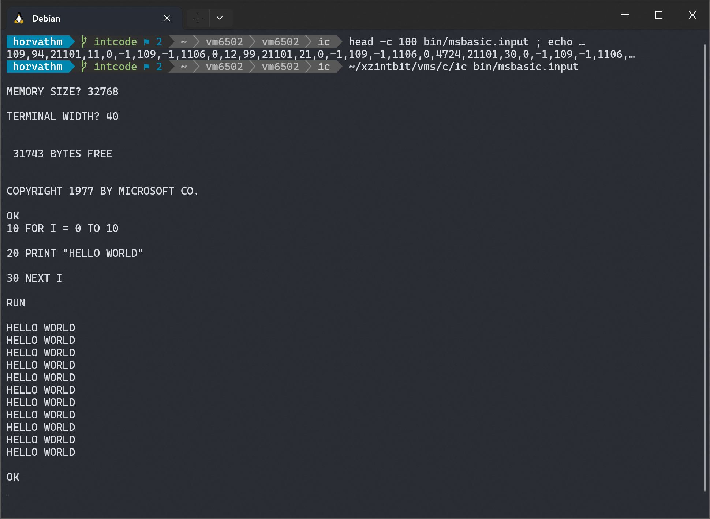

<div align="right"></div>

# Microsoft Basic on an Intcode Runtime

VM6502 is a virtual machine emulating the MOS 6502 processor, an 8-bit processor used in many home computers from the 80s, and is capable of running Microsoft Basic. The 6502 virtual machine itself is implemented in [Intcode](https://esolangs.org/wiki/Intcode), which a virtual machine introduced as part of [Advent of Code 2019](https://adventofcode.com/2019).

## Implementation Details

The 6502 emulator is written in Intcode assembly, which is a language that can be translated
into raw Intcode using my [xzintbit](https://github.com/matushorvath/xzintbit) Intcode assembler and linker. The assembler and linker are also written in Intcode, and are self-hosting.

## Trying it Out

You will need an Intcode virtual machine. Perhaps you created one as part of solving Advent of Code 2019. If it can run the Advent of Code assignments, it should be good enough to run Microsoft Basic as well. Or you could use one of [my Intcode virtual machines](https://github.com/matushorvath/xzintbit/tree/main/vms).

Specifically the Intcode virtual machine needs to meet the [AoC 2019 Day 9](https://adventofcode.com/2019/day/9) standard, with the [Aft Scaffolding Control and Information Interface (ASCII)](https://adventofcode.com/2019/day/17). In other words, it should implement all the instructions and use ASCII characters on standard input and output.

Download the pre-built [`msbasic.input`](https://github.com/matushorvath/vm6502/releases/download/v1.1.0/msbasic.input) file from this repository and run it on your Intcode virtual machine. If everything goes correctly, you should see a "MEMORY SIZE?" prompt from the Microsoft Basic interpreter.

The `msbasic.input` file contains plain Intcode in the same format that was used by Advent of Code assignments. It requires about 80.000 (80k) "bytes" of Intcode memory, and should work fine even with Intcode VMs that use signed 32-bit integers.



# Building it Yourself

This projects has multiple parts that you'll need to get working if you want to rebuild the sources. (This is not needed if you just want to see Microsoft Basic running on your Intcode virtual machine; see the [Trying it Out](#trying-it-out) section above.)

- You will need an Intcode virtual machine. Feel free to use your own, or you can use one of the Intcode virtual machines in the `vms` directory in the [xzintbit](https://github.com/matushorvath/xzintbit) repository.
- You will need the Intcode assembler and linker itself. Clone and build the [xzintbit](https://github.com/matushorvath/xzintbit) repository. See documentation in that repository for details, but a simple `make` should be enough to get you some results.
- Clone and build the [msbasic](https://github.com/matushorvath/msbasic) repository. This is a a slightly modified Microsoft Basic version that can run on an emulated 6502.
- Clone the [functional tests](https://github.com/Klaus2m5/6502_65C02_functional_tests) repository (no need to build it). This is used as a test suite to validate the 6502 virtual machine is working correctly.

Now you can the `msbasic.input` Intcode image. Please substitute the correct paths where the three repositories mentioned above were cloned.
   ```sh
   $ ICDIR=~/xzintbit MSBASICDIR=~/msbasic FUNCTESTDIR=~/6502_65C02_functional_tests make test
   ```

The functional test takes a minute or two to finish. If the build process looks frozen and the last output line mentions `func_test.input`, you're probably still waiting for the test. You can skip the test by running a plain `make` instead of `make test`.

Now you can execute the newly built image:
   ```sh
   $ ~/xzintbit/vms/c/ic bin/msbasic.input
   ```

You should now see the `MEMORY SIZE?` prompt from Microsoft Basic. Enter a reasonable memory size, for example `32786`, and a reasonable terminal width, for example `40`. Now you can start interacting with Basic (try `PRINT "HELLO WORLD"`).

## Q & A

Q: How complete is the 6502 emulation?  
A: All officially documented instructions are emulated. The virtual machine passes the basic [6502 functional test](https://github.com/amb5l/6502_65C02_functional_tests/blob/master/6502_functional_test.a65).

Q: Why Microsoft Basic?  
A: I was watching a Ben Eater [video](https://www.youtube.com/watch?v=XlbPnihCM0E) where he gets Microsoft Basic working on his home-built 8-bit computer. It turns out Microsoft Basic is very portable, you really just need to take care of console IO and it will run on any 6502 based computer.
